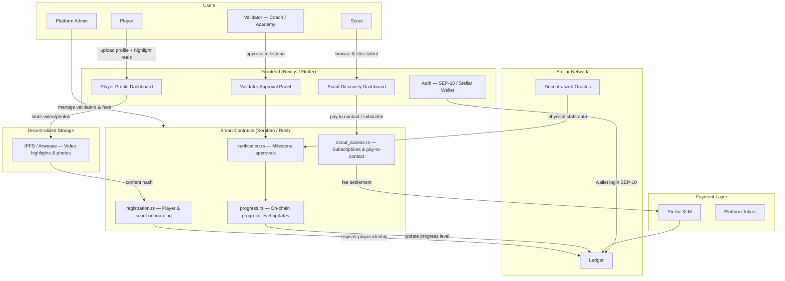
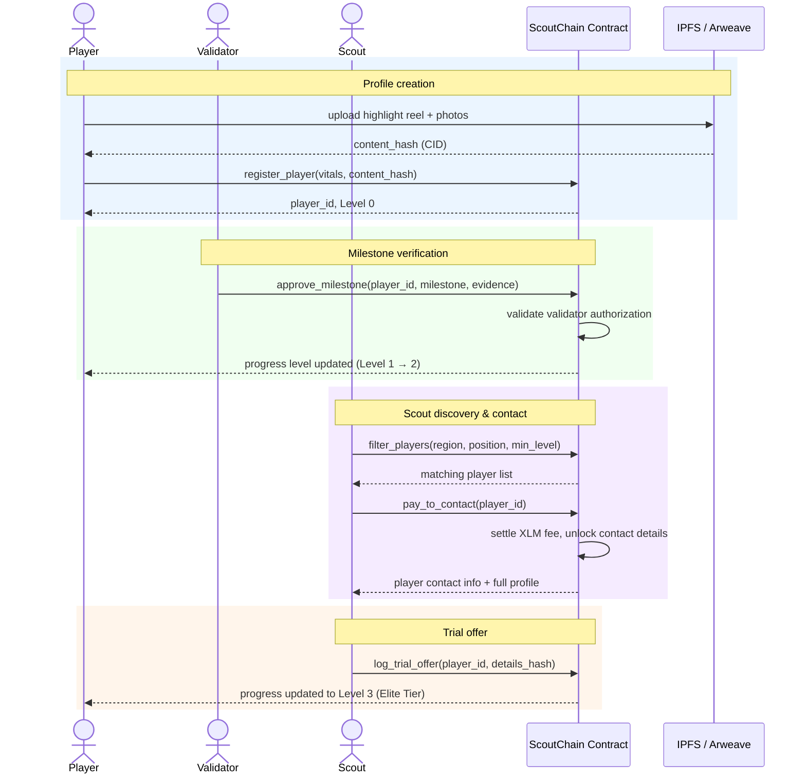

# ScoutChain

[](https://github.com/your-org/scoutchain/actions/workflows/contract-ci.yml)

Decentralized football talent scouting platform on Stellar — tamper-proof player profiles, on-chain progress verification, and direct scout-to-player connections powered by Soroban smart contracts.

## Overview

ScoutChain solves the visibility problem for undiscovered football talent worldwide. Players from underserved regions create dynamic on-chain profiles backed by verifiable milestones — approved by local coaches, academy directors, and certified trainers. Scouts browse a trusted, filterable talent pool and connect directly with players, with every interaction settled via Stellar's near-zero-cost payment layer.

Stellar is the backbone: transactions cost fractions of a cent and settle in 3–5 seconds, making microtransactions viable for scouts paying to unlock premium data or contact players across borders. Soroban smart contracts handle player registration, milestone verification, scout subscriptions, and secure connection agreements with auditable, tamper-proof logic.

## Features

- **Dynamic Player Profiles**: On-chain identity linked to highlight reels stored on IPFS/Arweave, with verified stats and vitals
- **Verifiable Progress Bar**: Milestones confirmed by authorized validators are written to the blockchain — no fake stats
- **Multi-Level Verification**: Four-tier trust system from unverified profile to elite scout-endorsed tier
- **Scout Discovery**: Filter players by region, position, and verified progress tier
- **Pay-to-Contact**: Scouts pay micro-fees in $XLM or platform token to unlock premium data or initiate contact
- **Validator Network**: Local coaches, academy directors, and certified trainers act as trusted on-chain validators
- **Wallet-Based Auth**: Players and scouts log in securely via Stellar wallets (Freighter, Albedo, or Lobstr) using SEP-10
- **Fractionalized Sponsorship** *(Future)*: Fans and local investors fund players via "Player Tokens" with transfer fee revenue sharing

## Architecture



### Core Components

- **registration.rs**: Handles player and scout onboarding, stores wallet address, IPFS content hashes, and basic vitals on-chain
- **verification.rs**: Processes milestone approval requests from authorized validators and emits verification events
- **progress.rs**: Manages the four-tier progress level system and updates player progress state on-chain
- **scout_access.rs**: Handles scout subscriptions, pay-to-contact flows, and connection agreement logic
- **storage.rs**: Persistent storage for player profiles, validator registry, and scout subscription records
- **events.rs**: Event emission for off-chain indexing (new profiles, milestone approvals, scout contacts)

### Progress Level Model

Progress levels are configured per player and enforced on-chain by authorized validators:

| Level | Name | Requirement |
|-------|------|-------------|
| 0 | Unverified | Player creates profile and uploads data |
| 1 | Verified Identity | KYC passed or academy confirms active club membership |
| 2 | Performance Milestones | Match footage or physical stats verified by approved third party |
| 3 | Elite Tier | Scout feedback or trial offers logged on-chain |

## Tech Stack

| Layer | Technology | Purpose |
|-------|------------|---------|
| Smart Contracts | Soroban (Rust) | Player registration, progress verification, scout subscriptions, secure connection agreements |
| Frontend | React / Next.js or Flutter | Mobile/web interface for player uploads and scout talent browsing |
| Backend & Storage | Node.js + IPFS | Heavy video files and photos stored on IPFS; content hashes saved on-chain in player profiles |
| Auth SDK | Stellar SEP-10 | Secure wallet-based login for players and scouts via Freighter, Albedo, or Lobstr |

## Smart Contract Functions

### Player Functions

- `register_player(wallet, vitals, ipfs_hashes)` — Create a new on-chain player profile at Level 0
- `update_profile(player_id, ipfs_hashes)` — Update highlight reel or photo links (player auth required)
- `get_profile(player_id)` — Retrieve full player profile and current progress level

### Validator Functions

- `approve_milestone(player_id, milestone, evidence_hash)` — Confirm a player achievement and trigger progress update (validator auth required)
- `register_validator(wallet, credentials)` — Onboard a new coach, academy, or trainer as an authorized validator (admin auth required)
- `revoke_validator(wallet)` — Remove a validator from the trusted registry (admin auth required)

### Scout Functions

- `subscribe(scout_wallet, tier)` — Purchase a scout subscription to access filtered talent pool
- `pay_to_contact(player_id, scout_wallet)` — Pay micro-fee to unlock premium data or initiate direct contact
- `log_trial_offer(player_id, scout_wallet, details_hash)` — Record a trial offer on-chain, advancing player to Level 3

### Admin Functions

- `initialize(admin, platform_token, fee_config)` — One-time contract setup
- `update_fee_config(fee_config)` — Adjust subscription and contact fee rates (admin only)
- `withdraw_fees(to)` — Withdraw accumulated platform fees (admin only)
- `pause_contract()` / `unpause_contract()` — Emergency circuit breaker (admin only)

### Query Functions

- `get_player(player_id)` — Full player profile with progress level and IPFS links
- `get_progress_history(player_id)` — Tamper-proof timeline of milestone approvals
- `filter_players(region, position, min_level)` — Scout discovery query
- `get_validators()` — Active validator registry
- `health()` — On-chain health check

## Progress Verification Flow

```
[ Player Uploads Video ]
         │
         ▼
[ Local Coach / Validator Approves ]
         │
         ▼
[ Soroban Smart Contract Updates Progress Level ] ──► [ Reflects on Scout Dashboard ]
```

### Milestone Examples

- "Scored 5 goals in Local Cup" → Level 2 milestone, approved by registered coach
- "Top speed clocked at 32 km/h" → Level 2 milestone, approved by certified trainer
- "Trial offer received from FC Example" → Level 3 milestone, logged by scout

## Player Lifecycle — Sequence Diagram



## Player Progress — State Machine

```
┌──────────────┐
│  Level 0     │  ← Profile created, data uploaded (Unverified)
└──────┬───────┘
       │
       ▼
┌──────────────┐
│  Level 1     │  ← Identity verified by academy or KYC
└──────┬───────┘
       │
       ▼
┌──────────────┐
│  Level 2     │  ← Performance milestones verified by approved third party
└──────┬───────┘
       │
       ▼
┌──────────────┐
│  Level 3     │  ← Scout feedback or trial offer logged (Elite Tier)
└──────────────┘
```

### Valid Transitions

| From | To | Trigger |
|------|----|---------|
| Level 0 | Level 1 | Validator calls `approve_milestone` — identity confirmed |
| Level 1 | Level 2 | Validator calls `approve_milestone` — performance stats verified |
| Level 2 | Level 3 | Scout calls `log_trial_offer` — trial or feedback recorded |

## Security Features

1. **Tamper-Proof History**: Every milestone approval is an immutable on-chain transaction — scouts see exactly when and how a player progressed
2. **Authorized Validators Only**: Only admin-registered validators can approve milestones, preventing self-reported fake stats
3. **Atomic Fee Settlement**: Scout contact fees and token transfers settle in a single transaction
4. **Authorization Checks**: All state-changing operations require proper Stellar account authorization
5. **Overflow Protection**: Safe arithmetic throughout all fee calculations
6. **Circuit Breaker**: Admin can pause the contract in an emergency without losing state

## Repository Structure

```
scoutchain-contracts/
├── contracts/
│   ├── registration/       # Player & scout on-chain identity
│   ├── verification/       # Validator registry & milestone approvals
│   ├── progress/           # Four-tier level state machine
│   └── scout_access/       # Subscriptions, pay-to-contact, trial offers
├── bindings/               # Auto-generated TypeScript clients (post-deploy)
│   ├── registration/
│   ├── verification/
│   ├── progress/
│   └── scout_access/
├── migrations/
│   └── 001_initial_schema.sql   # PostgreSQL schema for the backend indexer
├── scripts/
│   ├── setup-testnet.sh    # One-command full testnet setup
│   ├── deploy.sh           # Build, optimize, and deploy all contracts
│   ├── initialize.sh       # Initialize contracts + wire cross-contract link
│   └── generate-bindings.sh # Generate TypeScript clients from deployed WASMs
├── testnet/
│   └── seed.sh             # Fund test accounts and register demo data
├── config/
│   ├── testnet.json        # Testnet RPC, Horizon, and token addresses
│   └── mainnet.json        # Mainnet config (fill in RPC key before use)
├── docs/
│   ├── DEPLOYMENT.md       # Step-by-step deployment guide
│   ├── CONTRACT_REFERENCE.md # Full function reference for all contracts
│   └── CONTRIBUTING.md     # PR checklist and contribution guidelines
├── .env.example            # Environment variable template
├── ai.md                   # Cross-repo integration guide for AI assistants
└── Cargo.toml              # Workspace manifest
```

## Quick Start

### One command (recommended)

```bash
cp .env.example .env
# Fill in all six environment variables from .env.example
./scripts/setup-testnet.sh
```

This runs all five steps automatically: build → deploy → initialize → generate bindings → seed demo data. Contract IDs are saved to `.env.contracts`, TypeScript bindings to `bindings/`, and test account addresses to `testnet/.accounts`.

### Manual setup

#### 1. Prerequisites

```bash
# Rust with WASM target
rustup target add wasm32-unknown-unknown

# Stellar CLI
# https://developers.stellar.org/docs/tools/developer-tools/cli/install-stellar-cli
```

#### 2. Configure environment

```bash
cp .env.example .env
# Fill in all six required environment variables
```

#### 3. Build and deploy

```bash
./scripts/deploy.sh testnet
# Contract IDs written to .env.contracts
```

#### 4. Initialize and wire contracts

```bash
./scripts/initialize.sh testnet
# Initializes all four contracts and wires the verification → progress
# cross-contract link so approve_milestone advances levels atomically
```

#### 5. Generate TypeScript bindings

```bash
./scripts/generate-bindings.sh testnet
# Bindings written to bindings/{contract}/
# Import these in the backend and frontend repos
```

#### 6. Seed demo data (optional)

```bash
./testnet/seed.sh
# Creates funded test player, scout, and validator on testnet
```

## Cross-Contract Wiring

`approve_milestone` in the verification contract cross-calls `advance_level` in the progress contract atomically — both state changes happen in the same Stellar transaction. This is wired up by `initialize.sh` automatically:

```bash
stellar contract invoke \
  --id $VERIFICATION_CONTRACT_ID \
  -- set_progress_contract \
  --progress_contract $PROGRESS_CONTRACT_ID
```

Without this step, milestones are recorded but player levels do not advance.

## TypeScript Bindings

After deployment, run `./scripts/generate-bindings.sh testnet` to produce auto-generated TypeScript clients in `bindings/`. The backend and frontend import these directly:

```typescript
import { Client as RegistrationClient } from "@scoutchain/bindings-registration";
import { Client as ProgressClient }     from "@scoutchain/bindings-progress";
```

See `bindings/README.md` for usage details.

## Database Schema

`migrations/001_initial_schema.sql` creates the nine PostgreSQL tables the backend event indexer needs:

| Table | Purpose |
|-------|---------|
| `players` | Cached player profiles, indexed by region/position/level for fast filtering |
| `scouts` | Scout profiles |
| `validators` | Trusted validator registry |
| `milestones` | Approved milestone records per player |
| `scout_subscriptions` | Active subscription records |
| `contact_records` | Pay-to-contact audit log |
| `trial_offers` | On-chain trial offer records |
| `fee_withdrawals` | Platform fee withdrawal audit log |
| `indexer_cursor` | Horizon event stream checkpoint (single row) |

Run it against your backend PostgreSQL instance:

```bash
psql $DATABASE_URL -f migrations/001_initial_schema.sql
```


1. **Player Onboarding**
   - Connect Freighter wallet via SEP-10
   - Fill out profile: age, position, location, highlight reel links
   - Upload videos/photos to IPFS; content hashes saved on-chain
   - Profile starts at Level 0 (Unverified)

2. **Milestone Verification**
   - Local coach or academy director reviews footage or physical stats
   - Validator calls `approve_milestone` — transaction written to blockchain
   - Player's progress level updates automatically on the scout dashboard

3. **Scout Discovery**
   - Scout subscribes or pays per contact using $XLM or platform token
   - Filters talent by region, position, and minimum verified level
   - Views tamper-proof progress history before committing to a trial

4. **Trial & Elite Tier**
   - Scout logs a trial offer on-chain via `log_trial_offer`
   - Player advances to Level 3 (Elite Tier)
   - Connection agreement recorded as an immutable on-chain event

5. **Admin / Validator Management**
   - Admin registers trusted validators (coaches, academies, trainers)
   - Admin adjusts fee config and withdraws accumulated platform revenue
   - Emergency `pause_contract` available as a circuit breaker

## Configuration

Copy `.env.example` to `.env` and fill in all required values before running any script:

| Variable | Description |
|----------|-------------|
| `DEPLOYER_SECRET` | Stellar secret key used to deploy and invoke contracts |
| `ADMIN_ADDRESS` | Stellar G-address that will own all four contracts |
| `XLM_TOKEN_ADDRESS` | Native XLM token contract address on the target network |
| `STELLAR_NETWORK` | Target network: `testnet` or `mainnet` (default: `testnet`) |
| `HORIZON_URL` | Stellar Horizon endpoint for the target network |
| `SOROBAN_RPC_URL` | Soroban RPC endpoint for the target network |

Network-specific addresses are in `config/testnet.json` and `config/mainnet.json`.

After deployment, contract IDs are written to `.env.contracts` and must be copied into the backend and frontend repos:

```env
REGISTRATION_CONTRACT_ID=
VERIFICATION_CONTRACT_ID=
PROGRESS_CONTRACT_ID=
SCOUT_ACCESS_CONTRACT_ID=
```

### Mainnet Deployment Safety

When deploying to mainnet, **always verify** `config/mainnet.json` has been updated with real values before running `./scripts/deploy.sh mainnet`. The deployment script will reject the operation if placeholder values remain. Additionally:

1. Test the full deployment flow on testnet first
2. Verify all addresses in `.env` are correct for mainnet
3. Confirm `ADMIN_ADDRESS` is the intended account — ownership cannot be transferred after initialization
4. Double-check the `XLM_TOKEN_ADDRESS` matches the mainnet address (not testnet)

## Testing

```bash
# Run all contract tests
cargo test --workspace

# Run with output (useful for debugging)
cargo test --workspace -- --nocapture

# Lint and format check
cargo clippy --workspace -- -D warnings
cargo fmt --all -- --check
```

Contract test coverage:

- ✅ Player registration, duplicate prevention, profile updates
- ✅ Scout registration
- ✅ Validator registration, revocation, and active state checks
- ✅ Milestone approval — happy path, multiple milestones per player
- ✅ Revoked validator cannot approve milestones
- ✅ Unregistered validator cannot approve milestones
- ✅ Progress level sequence (Unverified → VerifiedIdentity → PerformanceMilestones → EliteTier)
- ✅ Cannot exceed EliteTier
- ✅ Progress history entries recorded per level change
- ✅ Scout subscription — Basic, Pro, Elite tiers with XLM fee settlement
- ✅ Pay-to-contact with active subscription
- ✅ Duplicate contact prevention
- ✅ Contact without subscription fails
- ✅ Subscription expiry enforcement
- ✅ Trial offer logging (Elite only)
- ✅ Trial offer rejected for non-Elite tier
- ✅ Fee accumulation and admin withdrawal
- ✅ Pause / unpause circuit breaker

## MVP Scope

The initial testnet MVP focuses on a single end-to-end flow:

1. One player registers a profile → contract stores identity and IPFS links at Level 0
2. One validator approves a milestone → progress updates to Level 1 or 2 on-chain
3. One scout pays to contact the player → fee settles in XLM, contact details unlocked

Secondary features (fractionalized sponsorship, oracle integrations, advanced filtering) ship in subsequent milestones.

## Roadmap

- [x] Workspace scaffold — four Soroban contracts with full type, error, and event modules
- [x] Player & scout registration contract with duplicate prevention and IPFS hash storage
- [x] Validator registry with credential tracking and active/revoked state
- [x] Milestone approval with on-chain evidence hashes
- [x] Four-tier progress level state machine with immutable history
- [x] Cross-contract wiring — `approve_milestone` atomically calls `progress.advance_level`
- [x] Scout subscriptions (Basic / Pro / Elite) with XLM fee settlement
- [x] Pay-to-contact with duplicate prevention and fee accumulation
- [x] Trial offer logging (Elite tier only)
- [x] Admin fee withdrawal and circuit breaker on all contracts
- [x] Full unit test coverage across all four contracts
- [x] CI pipeline — build, test, clippy, and format check on every PR
- [x] Deployment scripts — deploy, initialize, wire, and one-command setup
- [x] TypeScript binding generation script
- [x] PostgreSQL migration schema for the backend event indexer
- [x] Testnet seed script with Friendbot-funded demo accounts
- [x] Network config files (testnet + mainnet)
- [x] Cross-repo `ai.md` integration guide
- [ ] Scout subscription and pay-to-contact flow (backend + frontend)
- [ ] Trial offer logging UI and Level 3 advancement (backend + frontend)
- [ ] Decentralized oracle integration for physical stats
- [ ] Fractionalized Player Token sponsorship model
- [ ] Mobile-first Flutter frontend
- [ ] Security audit
- [ ] Mainnet launch

## Dependencies

- `soroban-sdk = "25.3.1"` — Soroban smart contract SDK (all four contracts)
- `stellar-cli` — Stellar CLI for deployment and contract invocation
- `wasm32-unknown-unknown` — Rust compilation target for Soroban WASM output

Frontend and backend dependencies live in their respective repos (`scoutchain-frontend`, `scoutchain-backend`).

## Error Codes

| Code | Error | Description | Common Cause | Resolution |
|------|-------|-------------|--------------|------------|
| 1 | AlreadyInitialized | Contract already initialized | Calling `initialize` twice | No action needed; contract is ready |
| 2 | NotInitialized | Contract not initialized | Operations before setup | Admin must call `initialize` first |
| 3 | ContractPaused | Contract is paused | Emergency circuit breaker active | Monitor official channels; wait for admin to unpause |
| 4 | Unauthorized | Caller is not authorized | Wrong account for admin operation | Confirm you are using the correct Stellar account |
| 5 | InsufficientFee | Payment amount below required fee | Underpaying contact fee | Check current fee via `get_fee_config` |
| 6 | ScoutNotSubscribed | Scout has no active subscription | Accessing talent pool without subscription | Call `subscribe` with valid tier and fee |
| 7 | SubscriptionExpired | Scout subscription has expired | Trying to access features after expiry | Renew subscription |
| 8 | AlreadyContacted | Scout already contacted player | Duplicate contact attempt | N/A |
| 9 | InvalidTier | Provided tier is invalid | Unknown subscription tier | Check valid tiers |
| 10 | Overflow | Arithmetic overflow in fee calculation | Extremely large XLM amount | Use amounts within safe i128 range |
| 11 | TrialOfferNotFound | Trial offer record not found | Invalid index or player ID | Verify offer details |
| 14 | ProgressCallFailed | Cross-contract call to progress failed | Contract interaction error | Verify progress contract status |
| 15 | NoFeesToWithdraw | No accumulated fees to withdraw | Withdrawing from empty balance | Ensure fees have been accumulated |
| 16 | AdminTransferred | Admin successfully transferred | Admin key rotation | N/A |

Wait, I need to match the actual variants and values in `errors.rs` to the table in `README.md`.
Let me re-read the `README.md`'s error table and `errors.rs`.
Actually, looking at `errors.rs`, I have `AlreadyInitialized = 1`, `NotInitialized = 2`, etc.
The table in `README.md` seems to be an *aggregated* table for all contracts, not just `scout_access`.
The table currently has:
| Code | Error | Description | Common Cause | Resolution |
|------|-------|-------------|--------------|------------|
| 1 | AlreadyInitialized | Contract already initialized | Calling `initialize` twice | No action needed; contract is ready |
| 2 | NotInitialized | Contract not initialized | Operations before setup | Admin must call `initialize` first |
| 3 | PlayerNotFound | Player ID does not exist | Invalid player_id | Verify the player_id from registration transaction |
| 4 | ValidatorNotAuthorized | Caller is not a registered validator | Unregistered account approving milestone | Admin must register the validator first |
| 5 | InvalidProgressTransition | Level transition is not allowed | Skipping levels or going backwards | Follow the valid transition table |
| 6 | ScoutNotSubscribed | Scout has no active subscription | Accessing talent pool without subscription | Call `subscribe` with valid tier and fee |
| 7 | InsufficientFee | Payment amount below required fee | Underpaying contact fee | Check current fee via `get_fee_config` |
| 8 | AlreadyRegistered | Wallet already has a profile | Duplicate registration | Use existing player_id |
| 9 | ContractPaused | Contract is paused | Emergency circuit breaker active | Monitor official channels; wait for admin to unpause |
| 10 | Unauthorized | Caller is not authorized | Wrong account for admin operation | Confirm you are using the correct Stellar account |
| 11 | Overflow | Arithmetic overflow in fee calculation | Extremely large XLM amount | Use amounts within safe i128 range |

I need to add the missing ones from `ScoutAccessError`.
`AlreadyInitialized` (1) - already there.
`NotInitialized` (2) - already there.
`ContractPaused` (3) - already there.
`Unauthorized` (4) - already there.
`InsufficientFee` (5) - already there.
`ScoutNotSubscribed` (6) - already there.
`SubscriptionExpired` (7) - missing.
`AlreadyContacted` (8) - missing.
`InvalidTier` (9) - missing.
`Overflow` (10) - already there.
`TrialOfferNotFound` (11) - missing.
`ProgressCallFailed` (14) - missing.
`NoFeesToWithdraw` (15) - missing.
`AdminTransferred` (16) - missing.


## Events

| Event | Emitted When |
|-------|-------------|
| `player_registered` | New player profile created on-chain |
| `milestone_approved` | Validator confirms a player achievement |
| `progress_updated` | Player advances to a new level |
| `scout_subscribed` | Scout purchases a talent access subscription |
| `player_contacted` | Scout pays to unlock player contact details |
| `trial_offer_logged` | Scout records a trial offer, advancing player to Level 3 |
| `fees_withdrawn` | Admin withdraws accumulated platform fees |

## Why Stellar

- Microtransactions: Scouts pay tiny fees to unlock data or contact players directly — no hefty banking fees across borders (e.g., a scout in Europe paying to contact a player in South America or Africa)
- Speed and Cost: Transactions cost fractions of a cent and settle in 3–5 seconds, ensuring a smooth experience for young players on mobile phones
- Fractionalized Sponsorship *(Future)*: Fans or local investors buy "Player Tokens" to fund a player's boots, travel, and training. If the player turns professional, a percentage of their transfer fee routes back to token holders via Stellar smart contracts

## License

MIT

## Documentation

- [docs/DEPLOYMENT.md](docs/DEPLOYMENT.md) — full deployment guide including mainnet checklist
- [docs/CONTRACT_REFERENCE.md](docs/CONTRACT_REFERENCE.md) — complete function reference for all four contracts
- [docs/CONTRIBUTING.md](docs/CONTRIBUTING.md) — PR checklist and contribution guidelines
- [ai.md](ai.md) — cross-repo integration guide for AI assistants and new team members

## Support

- GitHub Issues: [Create an issue](https://github.com/your-org/scoutchain/issues)
- Stellar Discord: https://discord.gg/stellar
- Stellar Developers: https://developers.stellar.org

## Contributing

See [docs/CONTRIBUTING.md](docs/CONTRIBUTING.md) for the full guide.

Quick checklist:
- All contract tests pass: `cargo test --workspace`
- Zero clippy warnings: `cargo clippy --workspace -- -D warnings`
- Formatting clean: `cargo fmt --all -- --check`
- New functions have tests and are documented in [docs/CONTRACT_REFERENCE.md](docs/CONTRACT_REFERENCE.md)
- Validator authorization logic changes require explicit review from a second team member
